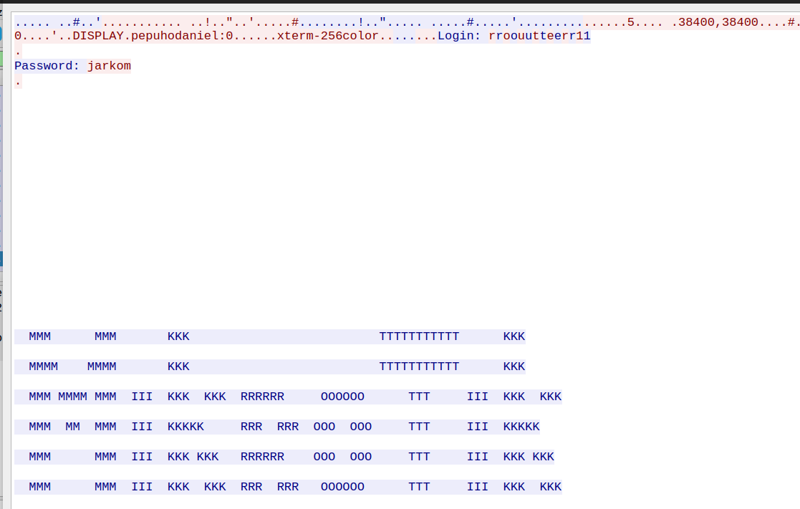
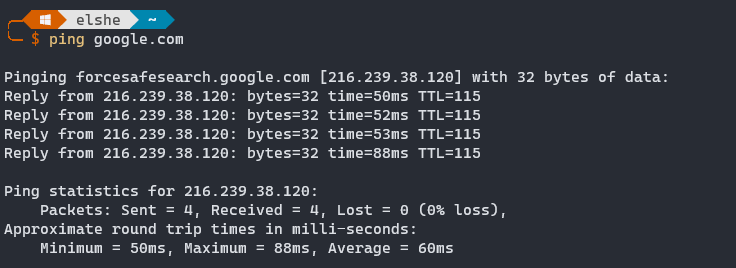

# Crimping and Wireshark

## Table of Content

+ 0.[Basic Command Line Tools for Network Connection](#0-basic-command-line-tools-for-network-connection)
    + [telnet](#01-telnet)
    + [nc](#02-netcat-nc)
    + [ping](#03-ping)
    + [ssh](#04-ssh-secure-shell)
+ 1.[IP and Port Concepts](#1-ip-and-port-concepts)
    + [IP Concept](#11-ip-concept)
    + [Port Allocation](#12-port-allocation)
+ 2.[Wire Crimping](#1-wire-crimping)
     + 2.1 [Tools needed](#21-tools-needed)
     + 2.2 [Cable Configuration](#22-cable-configuration)
     + 2.3 [Crimping Steps](#23-crimping-steps)
+ 3.[Wireshark](#3-wireshark)
  + 3.1 [Installation](#31-installation)
  + 3.2 [Filters](#32-filters)
  + 3.3 [Export Packet Capture Data](#33-export-packet-capture-data)
  + 3.4 [Wireshark Usage on FTP Server](#34-wireshark-usage-on-ftp-server)

## 0. Basic Command Line Tools for Network Connection

### 0.1 Telnet

Imagine you want to check if a website is accessible through port 80 (which is typically used for HTTP). With Telnet, you can type the command:

```
telnet google.com 80
```

If Telnet connects, it means the site is active and port 80 is open, allowing communication. This is a simple way to check if a service on a server (like a web service) is reachable from your computer.

#### So, what is Telnet?

Telnet (Telecommunication Network) is a network protocol that allows you to connect and interact with another computer remotely over a network, such as the internet or a LAN (Local Area Network). With Telnet, you can access files and data on another computer as if you were sitting right in front of it.

The main function of Telnet is to log into another computer (host/server) remotely and manage it. This can be very useful, for example, for system administration or remote troubleshooting.

However, Telnet has serious security weaknesses. Information like usernames and passwords are sent in plain text (unencrypted), making it easy for others on the network to intercept. As a result, Telnet is increasingly being replaced by more secure protocols like SSH.


### 0.2 SSH (Secure Shell)

Imagine you are a developer working from home and need to update code on your company's server. With SSH, you can log into the server from your home computer, edit or upload code files, and run programs to ensure everything is working correctly, as if you were directly in front of the server.


#### So, what is SSH?

SSH is a protocol that allows you to access and manage a computer or server remotely and securely. You can perform various tasks, such as running programs, creating or deleting files, and transferring files to other servers. SSH ensures that all data sent and received is protected with encryption, making it more secure than older methods like Telnet.

The SSH protocol operates using a client-server model. The connection involves an SSH client (the user's computer) connecting to an SSH server (the remote server).

The latest version of SSH is [SSH v2](https://www.synopsys.com/software-integrity/security-testing/fuzz-testing/defensics/protocols/ssh2-server.html). SSH is considered more secure compared to Telnet.

To connect using SSH, you would use the following command:
```
ssh username@host or
ssh username@host -p 2224
```

### 0.3 Netcat (nc)

Imagine you want to test if a server can receive data from your computer. With Netcat, you can send a message to the server and see if it responds. This is useful for checking network connections or debugging applications.


```
echo "Hello, Server!" | nc example.com 1234
```
This command will send the message "Hello, Server!" to the server at example.com on port 1234.

#### So, what is Netcat?

Netcat (or nc) is a command-line utility that reads and writes data through network connections, using TCP or UDP protocols. It is one of the most powerful tools for network troubleshooting and system administration, and is considered a multifunctional tool.

The syntax for Netcat is as follows:
```
nc [options] host port
```
By default, Netcat will attempt to start a TCP connection to the specified host and port. If you want to make a UDP connection, use the -u option.

### 0.4 Ping

Imagine you send a short message to a computer or server and wait for a reply. If the response comes back quickly, it means the network connection is good and the device is reachable. If there is no reply or the response is slow, there might be an issue with the connection or the device. Ping helps you determine if the network is functioning properly.

#### So, what is Ping?

Ping stands for Packet Internet Network Groper. Simply put, ping is a command used to check the status and availability of a host in a network.

The basic principle of ping is similar to using sonar to measure the depth of the sea. A signal is sent out, and the time it takes to return is used to make measurements.


source: [https://www.niagahoster.co.id/blog/apa-itu-ping/](https://www.niagahoster.co.id/blog/apa-itu-ping/)

Here’s how to perform a ping:



With the command above, you will get the following information:
+ Reply is the response from the host, along with the IP address information. The default command ideally gives four replies, but you might also see "Request Timed Out (RTO)" indicating no reply was received within the ping timeout period.
+ Bytes is the amount of data sent. For Windows, this is usually 32 bytes.
+ Time is the duration of the response from the host, measured in milliseconds (ms). A good ping time is under 100ms, especially for online gaming which requires low latency.
+ TTL (Time To Live) is the duration a data packet can stay in the network, recorded in seconds. Typically, TTL is set around 64 seconds.

## 1. IP and Port Concepts

### 1.1 IP Concept

Have you ever wondered how the internet knows that when you type google.com, you are directed to Google's website and not another site? Actually, the internet doesn't understand the name google.com directly. Instead, it uses an IP address to determine where to send the data. For example, google.com is actually linked to the IP address 8.8.8.8.

#### What is IP?

Imagine you have neighbors, and you distinguish your house from their houses using an address. An IP address is like a home address. Each device, such as a computer or smartphone, has its own address in the network. When you send something, like a letter or data, you need the recipient's address so that your delivery reaches the correct place. Similarly, an IP address ensures that data sent over the internet reaches the right device.


IP stands for Internet Protocol. So, an IP address or Internet Protocol address is the address used by the Internet Protocol to identify any device connected to a network, whether it is the internet or a local network.

Types of IP addresses:
#### a. IPv4

IPv4 is the most commonly used IP address, with a length of 32 bits and four sections (octets) separated by dots. Each octet's value ranges from 0 to 255. IPv4 stands for Internet Protocol version 4.

With this setup, it can be estimated that there are about 4.3 billion different IPv4 addresses worldwide.

Examples of IPv4 addresses include:

+ 169.89.131.246
+ 192.0.2.146
+ 01.102.103.104

Because it is the most widely used, almost all systems can handle IPv4 routing without issues. Additionally, IPv4 addresses support most network topologies due to their simple prefixes. Data in IPv4 address packets is also well-encrypted to ensure secure communication between networks.

#### b. IPv6

IPv6 is a newer version of the IP address designed to replace IPv4 due to the limited number of available IPv4 addresses.

While IPv4 has a length of 32 bits, IPv6 has a length of 128 bits. This means there are about 340 undecillion (a number with 66 zeros!) different IPv6 addresses.

IPv6 addresses are written in a series of 16-bit hexadecimal digits and letters, separated by colons. Therefore, you will encounter letters from A to F in this type of IP address.

Here are examples of IPv6 addresses:

+ 2001:3FFE:9D38:FE75:A95A:1C48:50DF:6AB8
+ 2001:0db8:85a3:0000:0000:8a2e:0370:7334
+ 2001:db8:3333:4444:CCCC:DDDD:EEEE
With IPv6, routing becomes more efficient because it allows Internet Service Providers to minimize the size of routing tables. IPv6 also uses Internet Protocol Security (IPsec), so you don't have to worry about authentication, data confidentiality, and integrity.

Additionally, IPv6 does not have an IP checksum, making packet processing more efficient, and supports multicast. As a result, data can be sent to multiple destinations simultaneously, saving network bandwidth.

### 1.2 Port Allocation

When you visit a building, you give the receptionist the apartment number you want to go to so they can direct you to the right place. Similarly, in a network, when you send data, you need to specify a port number so the data reaches the correct application or service on the computer or server.


#### So, what is a Port?

A port is a way that allows a computer to handle multiple connections and programs simultaneously on a network. Each port is associated with a specific application or service. For example, ports help the computer distinguish between incoming email and web pages because they use different ports.

To ensure compatibility, ports have a standardized system across all networked devices. Each port is identified by a 16-bit (two-byte) number called a Port Number.

**Logical Port**

A logical port is a pathway used by applications to connect with other computers over a TCP/IP network. One example is connecting a computer to the internet. Ports play a crucial role in computer networking.

Based on their numbering, logical ports are divided into three categories. Some ports are registered with the Internet Assigned Numbers Authority (IANA), while others are not. Here's the breakdown:

+ Well-known ports: Ranging from 0 – 1023. These are recognized or system ports. They always represent the same network services and are assigned by IANA.
+ Registered ports: Ranging from 1024 – 49151. These ports are known and registered with IANA but are not permanently assigned, allowing them to use the same port number.
+ Dynamically assigned ports: Ranging from 49152 – 65535. These ports are assigned by the operating system or application to serve requests from users as needed.

Here are some examples of commonly used logical ports and their functions:
+ Port 20 & 21 (FTP): A protocol used for transferring data within a network.
+ Port 22 (SSH): Used to send data over the network in encrypted form. It can be used for tasks that can be accessed remotely, such as connecting to a host or server.
+ Port 23 (TELNET): A port for connecting remote computers and servers. Its function is similar to SSH, but TELNET does not encrypt the connection.
+ Port 25 (SMTP): Ensures secure communication of emails between SMTP servers.
+ Port 53 (DNS): Serves as an IP address translator for each host.
+ Port 67 & 68 (DHCP): Dynamic Host Configuration Protocol assigns information related to IP addresses.
+ Port 80 (HTTP/Web Server): Enables browsers to connect to web pages.
+ Port 443 (HTTPS): Connects clients to the internet but with added security features that HTTP port 80 lacks. Port 443 encrypts network packets before transferring them.
+ Port 143 (IMAP): Internet Message Access Protocol, or IMAP, is a protocol for accessing emails from the server.

## 2. Wire Crimping
In a computer network, communication occurs between one device to the other. For this to happen, of course there needs a medium. Although there is already wireless communication technology, wires still have a major role in network and can't be replaced. Therefore, in this module, we will learn how to crimp a type of network cable called UTP (Unshielded Twisted Pair).

### 2.1 Tools needed

To do wire crimping, the following tools are needed.

#### a. UTP Cable


The base needed in this process.

#### b. RJ45


RJ45 is a the connector used to connect UTP cable to the devices.

#### c. Crimping Pliers


Crimping pliers or Crimpers are used to attach wires to RJ45.

#### d. LAN Tester


As the name suggests, this tool is used to check whether the cable we make is working properly or not.

### 2.2 Cable Configuration

  There are several types of cable configurations. Based on the color order, according to international standards, there are divided into __T568A__ and __T568B__.


While from the cable installation, there are divided into :

#### a. __Straight-Through Cable__

  This type of cabling is used to connect two different types of devices connected to the network, namely DTE (data terminal equipment) devices to DCE (data circuit-terminating equipment) or vice versa. DTE devices are devices that generate digital data and act as source and destination for digital data, e.g. computers, microcomputers, terminals, printers. DCE is a device that receives and converts data to the appropriate telecommunications link, generally DCE is a network device such as routers, switches, modems.
  

  
  The installation rule is that each end of the cable must have the same color sequence. For example, if the one end uses a color arrangement based on the T568A rule, so does the other one.

#### b. __Crossover Cable__

  In contrast to the Straight-through cable, crossover cable is used to connect the same two types of devices connected to the network, i.e. DTE to DTE or DCE to DCE devices. For example, between computers and computers, routers and routers, routers and switches, computers and printers.

  
  
  The installation rules are also different from straight-through cables, crossover cables have different color sequences at both ends. However, this color difference should not be arbitrary, because these two ends also have a color order rule. In standard crossover cables, if one end of the Pin has a color arrangement according to the T568A rule, then the other end of the Pin must have a color order according to the T568B standard.

### 2.3 Crimping Steps

  1. Prepare the crimping needs (UTP cable, RJ45, crimping pliers, LAN tester)
  2. Strip the UTP cable shield
  3. Sort the cables according to the configuration needed (Straight/Cross/others).
  4. Cut the ends of the wires to flatten them out.
  5. Insert the end of the cable into the RJ45 and make sure it touches the end of the RJ45.
  6. Use crimpers to lock the UTP cable in the RJ45 (make sure the cable end is still attached to the RJ45 end when locking is done)
  7. Finally, use a LAN tester to make sure the cable is working properly.

  ### Crimping Straight Video

[](https://youtu.be/NL0F8bP8k7I)

## 3. Wireshark
Wireshark is a network packet analyzer application. The network packet analyzer will try to capture network packets and display the packet data as detailed as possible. A computer network is built with the aim of sending or receiving data between one end-point and another. Data is sent in the form of packets. The structure of a package consists of:

***1. Header***
The header section contains the address and other data carried by the packet. The structure of the header includes:

| Instructions | Description |  
|--  |---|
| Packet length | Some networks already have a fixed-length packet , while others rely on headers to contain this information |  
| Synchronization | Bits that help packets match the intended network |  
| Packet number | Shows the order of the total packets available |
| Protocol | On networks that carry more than one kind of information, this protocol indicates the type of packet being transmitted, e.g., e-mail, web page, or other. |  
| Destination address | Where is the packet sent |  
| Source Address | Where did the packet come from |  

***2. Payload***
Payload is also referred to the **body** of the packet. This is where the data that will be sent via the packet is located.

***3. Trailer***
A trailer, or sometimes called a ***footer***, contains a pair of bits that signal to the reciever that the packet has reached its end. It can also provide some sort of *error checking*.

### 3.1 Installation

For installation on Windows OS or macOS, you can download the installer on [this page](https://www.wireshark.org/download.html). For Linux OS, see the tutorial [here](https://linuxtechlab.com/install-wireshark-linux-centosubuntu/).
After the installation completed, run Wireshark as an **administrator** (Windows) or as a **root** (Linux).
Here's the initial view :


### 3.2 Filters
In Wireshark, there are 2 types of filters, i.e. ***Capture Filter*** and ***Display Filter***

#### 3.2.1 Capture Filter


 - Definition : Filtering packets to be captured. Packets that don't meet the criteria are allowed to pass without being captured.
 - The filter syntax can consist of 1 or more **primitives**.  Primitive itself usually consists of an **id** (number or name) which is preceded by 1 or more types of qualifiers. Keep in mind that a primitive cannot have 2 or more of similar qualifiers.
 - Type of qualifier :

| Qualifier | Description | Example |
|--|--|--|
| type | Specifies the type of id or name to be the filter value | host, net, port, portrange |
| dir | Specifies a particular transfer direction to and/or from id | src, dst, etc|
| proto | Specifies the protocol from id | tcp, udp, etc |

 - The filter syntax can contain operators, parentheses, negations ( `!` / `not` ), and conjunctions ( `&&` / `and` or `||` / `or` ). Conjunctions are used to connect 2 primitives in one syntax
 - Example capture filter syntax :

| Filter expression / Primitive(s) | Description |
|--|--|
| `host 10.151.36.1` | Captures all specific packets from/to address 10.151.36.1 |
| `src host 10.151.36.1` | Captures all specific packets from address 10.151.36.1 |
| `net 192.168.0.0/24` or `net 192.168.0.0 mask 255.255.255.0` | Captures all packets from/to subnet 192.168.0.0/24 |
| `dst net 192.168.0.0/24` | Captures all packets going to subnet 192.168.0.0/24 |
| `udp port 80` | Captures all packets with UDP protocol from/to port 80 |
| `tcp src port 22 or host 10.151.36.30` | Captures all packets with TCP protocol from port 22 or packets from/to address 10.151.36.30 |

 - Example of capture filter `host 10.151.36.1`


#### 3.2.2 Display Filter


 - Definition : Filtering packets to be displayed from a collection of packets that have been captured.

 - In general, the display filter syntax consists of  `[protocol] [field] [comparison operator] [value]`. A complete list of available **comparison operators** is shown in :

| English | Comparison Operator (C-like) | Description |
|---|---|---|
| eq | == | Equal |
| ne | != | Not equal |
| gt | > | Greater than |
| lt | < | Less than |
| ge | >= | Greater than or equal to |
| le | <= | Less than or equal to |
| contains |  | Protocol, field or slice contains a value |
| matches | ~ | Protocol or text field matches a **regular expression** |
| bitwise_and | & | Bitwise AND operator|

 - The display filter can be combined with ***logical operator***.

| Logical Operator | Description |
|---|---|
| `and` or `&&` | logical AND |
| `or` | logical OR |
| `xor` or `^^` | logical XOR |
| `not` or `!` | logical NOT |
| `[...]` | substring operator |
| `in` | membership operator |

 - Some example on Display Filter :

| Filter expression | Keterangan |
|---|---|
| `tcp.port == 443` | Displays all packets with TCP protocol from/to port 443 |
| `ip.src == 192.168.0.1 or ip.dst == 192.168.0.1` | Displays all packets from address 192.168.0.1 or packets to address 192.168.0.1 |
| `http.request.uri constains "login"` | Display all packets with HTTP protocol whose URI contains "login" string.

 - As an example of display filter `tcp.port == 80`, the result is as follows :


### 3.3 Export Packet Capture Data

 1. After having the packet, select File on the menu bar -> Export Objects -> (select the desired protocol), in this case, the HTTP protocol is selected.

 2. Select the packet to be exported. In this case, the packet that load images from a particular site is selected. Then click Save and provide the file name, path, and extension if needed.

 3. File exported successfully.


### 3.4 Wireshark Usage on FTP Server

Run the wireshark application before connect to the FTP server.

#### 3.4.1 Connect ke Server

##### a. Windows

For windows, we will use FileZilla. For an experiment on the server, we used Filezilla Server and Filezilla Client on the client side. Here, we can set both server and client on the same device or use different devices (as long as they are connected to a computer network).

###### FTP Server Creation on Filezilla Server

1. Open Filezilla Server (can be accessed through the Filezilla Server desktop application or XAMPP by starting the Filezilla module and click the Admin button). If a pop up "Connect to Server" appears, just click Ok and the following display will appear.


2. Click Edit menu -> Users. In the Users column on the most right position, add a new user by clicking Add and entering the FTP username. Here are the results after adding the user (in this case, added the user "coba"). If you want to use a password, check the "Password" box and enter your password.


3. After the user is created. Then enter the shared folder settings to configure the folder to be shared or remotely via FTP. On the Users column, select user, and on the Shared folders column, click the "Add" button to add a directory. Next, we can set the permission for the user selected on the shared folder by checking the boxes in the Files and Directories sections.


FTP Server was created successfully.

#### 3.4.2 Client Connection

##### a. Using Filezilla client

Open FileZilla and enter *Host* , *Username* , *Password* , and *Port* of the server that we will connect to. Then, click Quickconnect to make a connection.


##### b. Using Linux command

`$ ftp [Host ip]`
Enter username and password, then run like using CLI.

When the capture results are available, the data will appear as shown below:


| Command | Descripton |
|---|---|
| USER | Username used to login to the FTP server |
| PWD | Password used to login to the FTP server |)

#### 3.4.3 Upload Files

##### a. Using Filezilla client
While using FileZilla client, drag files from Local site and drop on Remote site.

| Command | Description |
|---|---|
| STOR | Uploading files to FTP server |

##### b. Using Linux command
Upload command on Linux
```
$ put [full path file]
```

When the capture results are available, the data will appear as shown below:


#### 3.4.4 Download Files

##### a. Using Filezilla client
While using FileZilla client, drag files from Remote site and drop on Local site.

| Command | Decription |
|---|---|
| RETR | Downloading a file from an FTP server |

##### b. Using Linux command
Download command on Linux
```
$ get [filename]
```

When the capture results are available, the data will appear as shown below:


## Excercise

1. What is the difference between capture filter and display filter in wireshark based on captured packets?
2. What is the difference between `ip.dst` filter and `ip.dst_host` filter?
3. Do a `ping` on `1.1.1.1` (cloudflare dns server), apply a display filter that shows the packets in question, then find out what protocol is used!
4. Go to `http://example.com/index.html` page and get the source file `index.html` using wireshark!


## Reference
+ https://nyengnyeng.com/macam-macam-kabel-jaringan-komputer/
+ http://haidirhmc.blogspot.com/2011/12/urutan-warna-kabel-lan-atau-kabel-t568a.html
+ https://www.nesabamedia.com/pengertian-dan-fungsi-kabel-utp/
+ https://www.berguruit.com/2017/09/cara-crimping-kabel-lan-rj45-yang-baik.html
+ https://www.wireshark.org/docs/wsug_html_chunked/ChapterIntroduction.html
+ https://www.wireshark.org/docs/wsug_html_chunked/ChCapCaptureFilterSection.html
+ https://www.wireshark.org/docs/wsug_html_chunked/ChWorkBuildDisplayFilterSection.html
+ https://computer.howstuffworks.com/question5251.htm]
+ https://www.comparitech.com/net-admin/difference-between-straight-through-crossover-rollover-cables/
+ https://www.indowebsite.co.id/kb/cara-mengaktifkan-ftp-pada-localhost-atau-xammp/
