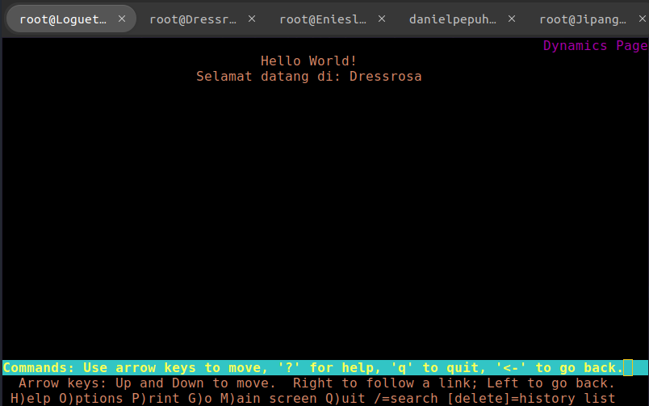
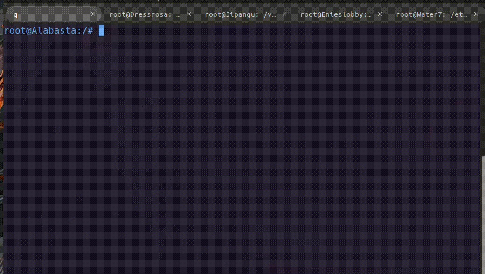
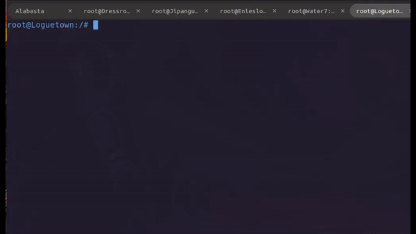
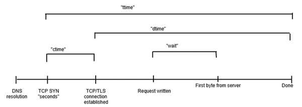

# 2. Reverse Proxy

## Outline

- [2. Reverse Proxy](#2-reverse-proxy)
  - [Outline](#outline)
  - [2.1 Pengertian, Cara Kerja, dan Manfaat](#21-pengertian-cara-kerja-dan-manfaat)
    - [2.1.1 Pengertian](#211-pengertian)
    - [2.1.2 Cara Kerja](#212-cara-kerja)
    - [2.1.3 Manfaat](#213-manfaat)
  - [2.2 Implementasi](#22-implementasi)
    - [2.2.1 Instalasi](#221-instalasi)
    - [2.2.2 Konfigurasi Dasar](#222-konfigurasi-dasar)
    - [2.2.3 Integrasi dengan PHP](#223-integrasi-dengan-php)
    - [2.2.4 Konfigurasi Reverse Proxy](#224-konfigurasi-reverse-proxy)
      - [A.  Melewatkan request yang masuk ke proxy server](#a-melewatkan-request-yang-masuk-ke-proxy-server)
      - [B. Menambahkan Request Headers](#b-menambahkan-request-headers)
      - [C. Proxy Binding](#c-proxy-bind)
    - [2.2.5 Load Balancing Lanjutan](#225-load-balancing-lanjutan)
      - [A. Round Robin](#a-round-robin)
      - [B. Least Connection](#b-least-connection)
      - [C. IP Hash](#c-ip-hash)
      - [D. Generic Hash](#d-generic-hash)
  - [2.3 Load Testing](#23-load-testing)
      - [2.3.1 Apache Benchmark](#231-apache-benchmark)
        - [A. Instalasi](#a-instalasi)
        - [B. Pengujian](#b-pengujian)
           - [1. Menguji Website HTTPS](#1-menguji-website-https)
           - [2. Plotting  output](#2-plotting-output)
           - [3. Menguji Website HTTP (jarkom.site) ](#3-menguji-website-http-jarkomsite)


## 2.1 Pengertian, Cara Kerja, dan Manfaat

### 2.1.1 Pengertian

Sebelum mengenal Reverse Proxy lebih jauh, perlu diketahui bahwa Reverse Proxy dan Proxy Service adalah 2 hal yang berbeda dari cara kerjanya. Secara singkat `Proxy Service` adalah service yang disediakan oleh suatu server, dimana server ini akan menjadi perantara bagi kita dan server atau website tujuan. Jadi ketika kita mengakses suatu website yang ada di internet kita akan terlebih dahulu terhubung ke Proxy Server.

Tak hanya itu, Proxy server juga cukup efektif digunakan sebagai sebuah gateway. Nantinya, semua koneksi yang dilakukan akan sesuai dengan setting gateway yang ditetapkan. Dengan begitu, tidak mudah disusupi serangan dari luar yang tidak diinginkan. Contoh aristektur sederhana yang menggunakan Proxy server.


Selanjutnya, `Reverse Proxy` adalah salah satu jenis server Proxy yang bertanggung jawab dalam meneruskan request client ke server. Reverse Proxy terletak diantara client dan server. Jadi, request yang dilakukan client akan diteruskan oleh Reverse Proxy untuk mencapai ke server. Mudahnya, Reverse Proxy ini berada diantara client dan server yang bertugas untuk menjamin pertukaran data antara client dan server berjalan dengan lancar.

Reverse Proxy biasanya diterapkan pada web server seperti `Apache` dan `Nginx`. Selain itu, dikutip dari [`CloudFlare`](https://www.cloudflare.com/learning/cdn/glossary/Reverse-Proxy/), Reverse Proxy juga digunakan sebagai keamanan agar proses pertukaran request dari client ke server atau sebaliknya berjalan dengan aman.

Tidak hanya itu, Reverse Proxy juga bisa melakukan kompresi data. Data yang besar akan dilakukan kompresi sehingga menjadi data dengan ukuran yang lebih kecil. Hal itu dapat membuat pertukaran data berjalan lebih cepat. Reverse Proxy juga memiliki kemampuan untuk menyeimbangkan load atau beban server agar server tidak down.

### 2.1.2 Cara Kerja

Seperti yang sudah dijelaskan diatas, Reverse Proxy berada diantara client dan server. Fungsi utama Reverse Proxy adalah menerima dan meneruskan request dari client ke server atau sebaliknya. Cara kerja Reverse Proxy bisa digambarkan seperti contoh berikut, misalnya kamu bertindak sebagai client yang ingin mengakses suatu website. Request yang diberikan client sebelum sampai ke server akan diterima oleh reverse proxy terlebih dahulu. Setelah itu Reverse Proxy akan meneruskan ke server dan kemudian menerima balasan dari server yang nantinya akan disampaikan ke client.


### 2.1.3 Manfaat

Karena di modul ini kita akan berfokus pada `Nginx` sebagai Reverse Proxy, maka berikut ini adalah beberapa menfaat ketika menggunakan Nginx sebagai Reverse Proxy.


Beberapa manfaat Nginx sebagi Reverse Proxy:

- `Load Balancing` - Reverse proxy dapat melakukan load balancing yang membantu mendistribusikan permintaan client secara merata di seluruh server backend atau worker. Proses ini sangat membantu dalam menghindari skenario di mana server tertentu menjadi kelebihan beban (over load) karena lonjakan permintaan yang tiba-tiba. Penyeimbangan beban juga meningkatkan redundansi seolah-olah satu server mati, proxy akan bertugas merutekan atau meredirect trafik yang masuk ke worker yang lainnya.

- `Powerful Caching` - Nginx dapat cache konten yang diterima dari respons server proxy dan menggunakannya untuk menanggapi client tanpa harus menghubungi server utama untuk konten yang sama setiap kali ada permintaan.

- `Superior Compression` - Jika server proxy tidak mengirim respons terkompresi, kita dapat mengonfigurasi Nginx untuk mengkompres `(contohnya: gzip)` respons sebelum mengirimnya ke client. Tentunya akan menghemat bandwidth dan mempercepat loading website.

- `Increased security` - Informasi mengenai server utama tidak dapat terlihat dari luar, sehingga sulit diserang oleh hacker. Reverse Proxy juga mencegah serangan `distibuted denial-of-service (DDOS)`.

## 2.2 Implementasi

### 2.2.1 Instalasi

Step 1 - Instalasi nginx di Dressrosa

```bash
apt-get update && apt-get install nginx
```

Step 2 - Cek status dari nginx

```bash
service nginx status
```


### 2.2.2 Konfigurasi Dasar

Step 1 - Instal lynx di Alabasta

```bash
apt update
apt-get install lynx
```

Step 2 - Cek menggunakan lynx


Step 3 - Lakukan pengujian dengan membuat file index.html di direktori `/var/www/html`.

```bash
<h1>Selamat Datang di Dressrosa</h1>
```

Step 4 - Ganti `server name` di `/etc/nginx/sites-available/default` dengan domain utama yang telah dibuat sebelumnya di
[modul persiapan](../prerequisite.md).

```bash
server_name jarkom.site;
```

Step 4 - Lakukan pengujian lagi, maka akan muncul halaman yang berbeda dari halaman sebelumnya.

```bash
lynx jarkom.site/index.html
```


### 2.2.3 Integrasi dengan PHP

Step 1 - Masih di Dressrosa, coba lakukan instalasi PHP

```bash
apt-get install php php-fpm
```

Step 2 - Buat script sederhana menggunakan PHP

Masuk ke direktori `/var/www/html`, lalu buat file index.php:

```php
<?php
$hostname = gethostname();

echo "Hello World!<br>";
echo "Selamat datang di: $hostname<br>";
?>
```

Step 3 - Edit default file nginx di `/etc/nginx/sites-available/default`

```bash
nano /etc/nginx/sites-available/default
```

Tambahkan index.php pada server block bagian `index`:

```bash
# Add index.php to the list if you are using PHP
index index.html index.htm index.php;
```

Uncomment beberapa bagian, seperti contoh di bawah:

```bash
location ~ \.php$ {
    include snippets/fastcgi-php.conf;
#
#   # With php-fpm (or other unix sockets):
    fastcgi_pass unix:/var/run/php/php7.2-fpm.sock;
#   # With php-cgi (or other tcp sockets):
#   fastcgi_pass 127.0.0.1:9000;
}
```

Step 4 - Lakukan pengujian dari Alabasta

```bash
lynx jarkom.site/index.php
```



### 2.2.4 Konfigurasi Reverse Proxy

### A. Melewatkan request yang masuk ke proxy server

Nginx di server utama akan mem-prokxy request, dimana server utama akan mengirimkan (melewatkan) request tersebut ke server proxy (worker tertentu), mengambil respons, dan mengirimkannya kembali ke client. Dimungkinkan untuk mem-proxy permintaan ke server HTTP (ke worker yang menggunakan Nginx  atau server yang tidak menggunakan Nginx) atau server non-HTTP (yang dapat menjalankan aplikasi yang dikembangkan dengan framework tertentu, seperti PHP atau Python) menggunakan protokol tertentu. Protokol yang didukung termasuk `FastCGI`, `uWSGI`, `SCGI`, dan `Memcached`.

Untuk meneruskan permintaan ke server proxy, maka bisa menggunakan `proxy_pass` yang spesifikan di `location` tertentu. Untuk meneruskan request ke proxy server kita bisa menggunakan `nama domain atau alamat IP` dari server proxy yang tersebut, kita juga bisa menspesifikan `port` nya.

Contoh sederhana penggunaan `proxy_pass` di server utama:

```bash
location /some/path/ {
    proxy_pass http://www.example.com/link/;
}
```

```bash
location /some/path/ {
    proxy_pass http://192.168.1.1/link/;
}
```

Konfigurasi di sisi worker, karena berbasis PHP maka kita menggunakan `PHP-FPM (FastCGI Process Manager)`:

```bash
server {
        listen 80;

        server_name _;

        root /var/www/html

        index index.html index.htm index.php;

        location / {
                        # First attempt to serve request as file, then
                        # as directory, then fall back to displaying a 404.
                        try_files $uri $uri/ =404;
                }
        # pass PHP scripts to FastCGI server
        #
        location ~ \.php$ {
                include snippets/fastcgi-php.conf;
        #
        #       # With php-fpm (or other unix sockets):
                fastcgi_pass unix:/var/run/php/php7.2-fpm.sock;
        #       # With php-cgi (or other tcp sockets):
        #       fastcgi_pass 127.0.0.1:9000;
        }
}
```

#### Catatan

- `proxy_pass` - merupakan salah satu [modul](http://nginx.org/en/docs/http/ngx_http_proxy_module.html) yang ada di nginx, digunakan untuk meneruskan request ke alamat tertentu.

- `FastCGI` - `Fast Common Gateway Interface (FastCGI)` adalah protokol standar untuk menghubungkan aplikasi eksternal ke web server. Ini adalah versi peningkatan fitur dari [Common Gateway Interface (CGI)](https://www.geeksforgeeks.org/common-gateway-interface-cgi/).

- `PHP-FPM` - `FastCGI Process Manager (PHP-FPM)` adalah implementasi FastCGI untuk bahasa PHP. PHP-FPM merupakan interpreter PHP yang terpisah dari aplikasi web server. Setiap request atas script PHP yang masuk ke web server akan diteruskan (forward) ke FastCGI melalui socket atau koneksi TCP/IP.

- `uWSGI` - adalah implementasi dari `Web Server Gateway Interface (WSGI)` yang biasanya digunakan untuk menjalankan aplikasi web berbasis Python.

- `SCGI` - `SCGI (Simple Common Gateway Interface)` adalah protokol komunikasi antara server web dan aplikasi web. Ini mirip dengan CGI (Common Gateway Interface), tetapi dirancang untuk lebih efisien dan cepat. Beberapa server web yang mendukung SCGI termasuk Apache dengan mod_scgi, lighttpd, dan beberapa server web lainnya.

- `Memcached` - Memcached adalah sistem penyimpanan cache dalam memori yang digunakan untuk meningkatkan kinerja situs web atau aplikasi dengan menyimpan data dalam memori RAM, sehingga mengurangi kebutuhan untuk mengakses sumber daya yang lebih lambat seperti basis data atau penyimpanan disk. Dalam case Nginx, Memcached digunakan untuk mengarahkan request atau permintaan ke server Memcached yang telah dibuat. Lengkapnya bisa dibaca di dokumentasi [Memcached](https://memcached.org/about).

#### Konfigurasi `proxy_pass`

Step 1 - Di Jipangu, pastikan sebelumnya telah menginstal `Nginx dan PHP`. Uncoment beberapa konfigurasi `default` di `/etc/nginx/sites-available`.

- Arahkan ke DocumenRoot yang diinginkan di block `root`:

  ```bash
  root /var/www/html
  ```

- Tambahkan `index.php` di block index:

  ```bash
  index index.html index.htm index.nginx-debian.html index.php;
  ```

Konfigurasi PHP menggunakan `FastCGI server`

```bash
        # pass PHP scripts to FastCGI server
        #
        location ~ \.php$ {
                include snippets/fastcgi-php.conf;
        #
        #       # With php-fpm (or other unix sockets):
                fastcgi_pass unix:/var/run/php/php7.2-fpm.sock;
        #       # With php-cgi (or other tcp sockets):
        #       fastcgi_pass 127.0.0.1:9000;
        }

```

Step 2 - Buat file `index.php` di `/var/www/html`.

```php
<?php
$hostname = gethostname();
$php_version = phpversion();

echo "About $hostname<br>";
echo "Versi PHP yang saya gunakan: $php_version<br>";
?>
```

Step 3 - Jangan lupa start service `PHP FPM`.

```bash
/etc/init.d/php7.2-fpm start
```

Atau

```bash
service php7.2-fpm start
```

Step 4 - Kembali ke Dressrosa, tambahkan `location` baru di `/etc/nginx/sites-available/default`.

```bash
location /about-jipangu/ {
        proxy_pass http://<ip_jipangu>/index.php;
}
```

Step 5 - Simpan konfigurasi, lalu restart service nginx.

```bash
service nginx restart
```

Step 6 - Lakukan pengujian melalui client menggunakan lynx.

```bash
lynx jarkom.site/about-jipangu
```


### B. Menambahkan Request Headers

Directive di Nginx yang digunakan untuk mengatur header HTTP yang dikirim ke server backend atau worker saat proxying request. Modul yang bisa digunakan yaitu [proxy_set_header](https://nginx.org/en/docs/http/ngx_http_proxy_module.html#proxy_set_header). Format nya adalah:

```bash
proxy_set_header <header> <value>;
```

`<header>` - adalah nama header yang ingin diatur

`<value>` - adalah nilai yang ingin ditetapkan dari suatu header

Aturan penggunaan header:

- nama header harus diawali dengan huruf kapital dan tidak boleh menggunakan spasi.
- nilai dari header berupa string, angka.
- konteks penggunaannya bisa di dalam `server`, `location` tertentu dan `upstream`.

Contoh sederhana penggunan `proxy_set_header`:

```bash
location /some/path/ {
    proxy_set_header Host $host;
    proxy_set_header X-Real-IP $remote_addr;
    proxy_pass http://example.com:8000;
}
```

#### Catatan

`location /some/path/` - Header ini menjelaskan bahwa Nginx akan mem-proxy semua request yang masuk di `/some/path` secara otomatis akan dialihkan ke alamat `http://example.com` dengan port 8000.

`proxy_set_header Host $host` - Header ini menyatakan bahwa Nginx akan mengatur header Host di request yang dikirim ke worker agar sesuai dengan header `Host` di request asli dari client. Hal ini diperlukan agar server backend atau worker dapat mengetahui URL mana yang diakses oleh client.

`proxy_set_header X-Real-IP $remote_addr` - Header X-Real-IP berisi alamat IP client yang mengirimkan request, tanpa melewati proxy. Hal ini berguna jika server worker perlu mengetahui alamat IP client yang sebenarnya, misalnya untuk tujuan logging atau keamanan.

#### Konfigurasi `proxy_set_header`

```bash
location /about-jipangu/ {
        proxy_pass http://192.168.2.5/index.php;
        proxy_set_header Host $Host;
        proxy_set_header X-Real-IP $remote_addr;
}
```

### C. Proxy Bind

Jika kita memiliki beberapa server proxy untuk menerima request dari client, kita bisa menggunakan modul [proxy_bind](https://nginx.org/en/docs/http/ngx_http_proxy_module.html#proxy_bind) untuk melakukan binding.

Contoh sederhana penggunaan `proxy_bind`:

```bash
location /app1/ {
    proxy_bind 127.0.0.1;
    proxy_pass http://example.com/app1/;
}

location /app2/ {
    proxy_bind 127.0.0.2;
    proxy_pass http://example.com/app2/;
}
```

Konfigurasi sederhana menggunakan `proxy_bind`

```bash
location /app1/ {
        # Dressrosa
        proxy_bind 127.0.0.1;
        proxy_pass http://127.0.0.1/index.php;
}

location /app2/ {
        # Enieslobby
        proxy_bind 192.168.2.2;
        proxy_pass http://192.168.2.3/index.php;
}

location /app3/ {
        # Jipangu
        proxy_bind 192.168.2.2;
        proxy_pass http://192.168.2.5/index.php;
}
```



#### Catatan

`proxy_bind <ip_address>` - Menentukan alamat IP yang akan digunakan oleh server utama untuk melakukan binding ke server backend atau worker.

`proxy_pass http://<ip_address>` - Meneruskan permintaan clien ke server backend atau worker.

### 2.2.5 Load Balancing Lanjutan

Jika di modul 2, kita telah mencoba salah satu metode atau algoritma load balancing yaitu `Round Robin`, pada modul kali ini kita akan mencoba algoritma lainnya yaitu: `Least-connection`, `IP Hash`,  dan `Generic Hash`. Diharapkan kalian telah membaca pengertian dan cara kerjanya di [modul 2](https://github.com/arsitektur-jaringan-komputer/Modul-Jarkom/blob/master/Modul-2/Web%20server/README.md#b-load-balancing-pada-nginx).

Pada modul ini kita akan mengkonfigurasi semua metode load balancing yang dibahas sebelumnya.

#### A. Round Robin

Merupakan algoritma load balancing default yang ada di Nginx, cara kerjanya yaitu jika kita memiliki 3 buah node, maka urutannya adalah dari node pertama, kemudian node kedua, dan ketiga. Setelah node ketiga menerima beban, maka akan diulang kembali dari node ke satu.

Konfigurasi:

Step 1 - Pastikan di Water 7, Jipangu, dan Enieslobby telah terinstall Nginx dan PHP

```bash
apt-get update && apt-get install nginx php
```

step 2 - Modifikasi konfigurasi Nginx, buat file baru di `/etc/nginx/sites-available/jarkom`. Lakukan hal ini di semua worker Nginx selain Dressrosa. Untuk menonaktifkan konfigurasi `default` pada `/etc/nginx/sites-available` bisa menggunakan perintah `unlink /etc/nginx/sites-available/default`.

```bash
server {

listen 80;

root /var/www/jarkom;

index index.php index.html index.htm;
server_name _;

location / {
        try_files $uri $uri/ /index.php?$query_string;
}

# pass PHP scripts to FastCGI server
location ~ \.php$ {
        include snippets/fastcgi-php.conf;
        fastcgi_pass unix:/var/run/php/php7.2-fpm.sock;
}

location ~ /\.ht {
        deny all;
}

error_log /var/log/nginx/jarkom_error.log;
access_log /var/log/nginx/jarkom_access.log;
}
```

Step 3 - Lalu modifikasi juga file  `index.php` di masing-masing worker.

```php
<?php
$hostname = gethostname();
$php_version = phpversion();
?>

<center>
<h1>About <?php echo $hostname; ?></h1>
<p>Versi PHP yang saya gunakan: <?php echo $php_version; ?></p>
</center>
```

Step 4 - Menambahkan file konfigurasi baru untuk Nginx di `/etc/nginx/sites-available`, contoh filenya `lb-jarkom`.

```bash
#Default menggunakan Round Robin
upstream backend  {
server 192.168.2.3; #IP EniesLobby
server 192.168.2.4; #IP Water7
server 192.168.2.5; #IP Jipangu
}

server {
listen 80;
server_name jarkom.site;

        location / {
                proxy_pass http://backend;
                proxy_set_header    X-Real-IP $remote_addr;
                proxy_set_header    X-Forwarded-For $proxy_add_x_forwarded_for;
                proxy_set_header    Host $http_host;
        }
}
```

Step 5 - Unlink default config di `/etc/nginx/sites-enabled` dan symlink file `lb-jarkom` ke `/etc/nginx/sites-enabled`

```bash
unlink /etc/nginx/sites-enabled/default
```

```bash
ln -s /etc/nginx/sites-available/lb-jarkom /etc/nginx/sites/enabled/
```

```bash
service nginx restart
```



#### Weighted Round Robin

Cukup dengan menetapkan weight atau beban ke masing-masing server di kumpulan server yang telah ditentukan sebelumnya. Server yang memiliki weight paling besar akan dijadikan prioritas ketika menerima request dari client

Weight dapat digunakan untuk mengoptimalkan load balancing dan memastikan bahwa server yang lebih kuat memiliki beban yang lebih besar.


Konfigurasi:

```bash
upstream backend  {
   server 192.168.2.3 weight=4; #IP EniesLobby
   server 192.168.2.4 weight=2; #IP Water7
   server 192.168.2.5 weight=1; #IP Jipangu
}
```

#### B. Least Connection

Jika Round robin akan mendistribusikan berdasarkan nomor dan urutan server, maka least-connection akan melakukan prioritas pembagian dari beban kinerja yang paling rendah. Node master akan mencatat semua beban dan kinerja dari semua node, dan akan melakukan prioritas dari beban yang paling rendah. Sehingga diharapkan tidak ada server dengan beban yang rendah.

Konfigurasi:

```bash
#Least Connection
upstream backend  {
least_conn;
server 192.168.2.3; #IP EniesLobby
server 192.168.2.4; #IP Water7
server 192.168.2.5; #IP Jipangu
}

server {
listen 80;
server_name jarkom.site;

        location / {
                proxy_pass http://backend;
                proxy_set_header    X-Real-IP $remote_addr;
                proxy_set_header    X-Forwarded-For $proxy_add_x_forwarded_for;
                proxy_set_header    Host $http_host;
        }
```

#### C. IP Hash

Agak berbeda dengan kedua algoritma di atas, algoritma ini akan melakukan hash berdasarkan request dari pengguna (menggunakan alamat IP dari pengguna). Sehingga server akan selalu menerima request dari alamat IP yang berbeda. Ketika server ini tidak tersedia, permintaan dari klien ini akan dilayani oleh server lain.

Konfigurasi:

```bash
# IP Hash
upstream backend  {
   ip_hash;
   server 192.168.2.3; #IP EniesLobby
   server 192.168.2.4; #IP Water7
   server 192.168.2.5; #IP Jipangu
}

server {
   listen 80;
   server_name jarkom.site;

   location / {
       proxy_pass http://backend;
       proxy_set_header    X-Real-IP $remote_addr;
       proxy_set_header    X-Forwarded-For $proxy_add_x_forwarded_for;
       proxy_set_header    Host $http_host;
   }

  error_log /var/log/nginx/lb_error.log;
  access_log /var/log/nginx/lb_access.log;
}
```

#### D. Generic Hash

Generic hash adalah jenis load balancing yang menggunakan algoritma hash untuk mendistribusikan lalu lintas ke server backend. Algoritma hash ini menggunakan hash dari nilai tertentu untuk menentukan server backend atau worker mana yang akan menangani permintaan.

Nilai yang digunakan untuk hash dapat berupa apa saja, seperti alamat IP client, nilai HTTP headers dan lain-lain. Nilai hash ini kemudian digunakan untuk menentukan server backend mana yang akan menangani permintaan.

```bash
upstream backend  {
   hash $request_uri consistent;
   server 192.168.2.3; #IP EniesLobby
   server 192.168.2.4; #IP Water7
   server 192.168.2.5; #IP Jipangu
}

server {
   listen 80;
   server_name jarkom.site;

   location / {
       proxy_pass http://backend;
       proxy_set_header    X-Real-IP $remote_addr;
       proxy_set_header    X-Forwarded-For $proxy_add_x_forwarded_for;
       proxy_set_header    Host $http_host;
   }

  error_log /var/log/nginx/lb_error.log;
  access_log /var/log/nginx/lb_access.log;
}
```

### 2.3 Load Testing

Apa itu **load testing**? Singkatnya **load testing** adalah  jenis pengujian perangkat lunak yang bertujuan untuk menguji performa dan kinerja sistem saat menghadapi beban yang tinggi atau penggunaan yang ekstensif. Dalam Load testing, sistem dikenakan beban simulasi yang tinggi untuk mengukur kemampuan sistem dalam menangani jumlah pengguna, transaksi, atau permintaan yang besar secara bersamaan.

Tujuan dari Load Testing:

- Mengekspos kecacatan pada aplikasi seperti *buffer overflow*, *memory leaks*, dan *mismanagement memory*.
- Menentukan batas atas dari komponen-komponen sistem, seperti database, hardware, network, load balancing yang digunakan, dll.

Tools yang bisa digunakan untuk load testing seperti [Apache JMeter](https://jmeter.apache.org/), [Apache Benchmark atau ab](https://httpd.apache.org/docs/2.4/programs/ab.html), [wrk](https://github.com/wg/wrk), [Locust](https://locust.io/), dll.

### 2.3.1 Apache Benchmark

Apache Benchmark (ab) adalah tool pengujian beban atau load testing dan benchmarking untuk server Hypertext Transfer Protocol (HTTP). Apache bench sangat mudah dijalankan di terminal. Output pengujian beban cepat dapat diperoleh hanya dalam satu menit.Untuk menggunakan alat ini, tidak diperlukan pengaturan yang rumit. Selain itu, ia terinstal secara otomatis dengan server web Apache, atau dapat diinstal secara terpisah sebagai utilitas Apache.

#### A. Instalasi

Apache benchmark sendiri sangan mudah proses instalasinya, sudah ada sejak kita menginstall Apache2 atau dapat diinstall sebagai utilitas.

```bash
apt-get update && apt-get install apache2-utils
```

Atau jika sudah melakukan proses update sebelumnya, cukup dengan menginstall packagenya:

```bash
apt-get install apache2-utils
```

Verifikasi instalasi:

```
ab -V
```


#### B. Pengujian

#### 1. Menguji Website HTTPS

Step 1 - Ganti `resolv.conf` terlebih dahulu agar bisa mengakses ke internet:

```bash
nameserver 192.168.122.1
#nameserver 192.168.2.3
```

Step 2 - Kita akan menguji website `apache.org` menggunakan Apache bencmark:

```bash
ab -n 100 -c 10 https://www.apache.org/
```

Penjelasan:

`ab` - Apache bench command.

`-n` - argument untuk  menentukan jumlah permintaan atau request. Secara default jika kita tidak menentukan jumlah request, maka jumlah request = 1.

`-c` - adalah konkurensi, menunjukan jumlah beberapa permintaan yang dilakukan secara bersamaan. Jika kita tidak menentukan jumlah konkurensi, maka defaultnya adalah satu permintaan dalam satu waktu.

`URL` - path url yang ingin ditest. Perlu diingat juga untuk menambahkan tanda **/** di akhir url yang kita uji.

Ouput:

```bash
This is ApacheBench, Version 2.3 <$Revision: 1807734 $>
Copyright 1996 Adam Twiss, Zeus Technology Ltd, http://www.zeustech.net/
Licensed to The Apache Software Foundation, http://www.apache.org/

Benchmarking www.apache.org (be patient).....done


Server Software:        Apache
Server Hostname:        www.apache.org
Server Port:            443
SSL/TLS Protocol:       TLSv1.2,ECDHE-RSA-CHACHA20-POLY1305,2048,256
TLS Server Name:        www.apache.org

Document Path:          /
Document Length:        64667 bytes

Concurrency Level:      10
Time taken for tests:   3.741 seconds
Complete requests:      100
Failed requests:        0
Total transferred:      6601140 bytes
HTML transferred:       6466700 bytes
Requests per second:    26.73 [#/sec] (mean)
Time per request:       374.053 [ms] (mean)
Time per request:       37.405 [ms] (mean, across all concurrent requests)
Transfer rate:          1723.40 [Kbytes/sec] received

Connection Times (ms)
              min  mean[+/-sd] median   max
Connect:       83  132  31.9    124     214
Processing:    84  235  89.5    246     376
Waiting:       25   75  45.1     58     227
Total:        237  367  86.5    371     518

Percentage of the requests served within a certain time (ms)
  50%    371
  66%    417
  75%    450
  80%    460
  90%    480
  95%    504
  98%    518
  99%    518
 100%    518 (longest request)
```

Penjelasan:

`Server Software` - nama dari web server yang digunakan

`Server Hostname` - nama domain atau DNS, selain DNS bisa IP Adress juga.

`Server Port` - port yang digunakan ab untuk  konek ke website, karena menggunakan HTTPS maka portnya adalah 443, jika menggunakan HTTP, maka portnya adalah 80.

`SSL/TLS Protocol` - protokol negosiasi antara server dan client.

`Document Path` - path yang diakses atau dihit oleh ab.

`Document Length` - ukuran dalam bytes dari suatu `Document` yang berhasil di return, Jika panjang `Document` berubah selama pengujian, responsnya dianggap error.

`Concurrency Level` - jumlah beberapa request yang dilakukan secara bersamaan.

`Time Taken for Tests` - rentang waktu yang dibutuhkan, mulai dari proses testing menggunakan ab sampai proses terakhir menerima respon.

`Complete Requests` - jumlah dari respon yang berhasil selama proses testing.

`Failed Requests` - jumlah dari respon yang gagal selama proses testing.

`Total Transferred` - jumlah total (dalam byte) yang diterima dari server.

`HTML Transferred` - jumlah total (dalam byte) dokumen yang diterima dari server. Jumlah ini tidak termasuk byte yang diterima di header HTTP

`Requests per second` - jumlah permintaan per detik. Nilai ini merupakan hasil pembagian jumlah permintaan dengan total waktu yang dibutuhkan.

`Time per request` - Rata-rata waktu yang dihabiskan per permintaan. Nilai pertama dihitung dengan rumus: concurrency * timetaken * 1000/done sedangkan nilai kedua dihitung dengan rumus timetaken * 1000/done.

`Transfer rate` - Kecepatan transfer. Dihitung dengan rumus totalread / 1024 / timetaken.

#### 2. Plotting  output

Kita akan mencoba untuk memplot hasil yang relevan untuk melihat berapa banyak waktu yang dibutuhkan server seiring dengan meningkatnya jumlah permintaan. Caranya yaitu dengan menambahkan opsi `-g` pada command sebelumnya diikuti dengan nama file, contoh: `out.data` di mana data keluaran ab akan disimpan ke dalam file tersebut.

Step 1 - Buat direktori baru di `root`, dimana direktori tersebut akan digunakan untuk menyimpan output selama proses benchmark.

```bash
cd /root/
```

```bash
mkdir benchmark && cd benchmark
```

Step 2 - Jalankan command `ab` ditambahkan argumen `-g`.

```bash
ab -n 100 -c 10 -g out.data https://www.apache.org/
```

Step 3 - Cek isi dari file `out.data`.

```bash
cat out.data
```

Atau menggunakan command `less`, jika  muncul pesan `command not found` install telebih dahulu.

```bash
apt install less -y
```

```bash
less out.data
```

Output:

```bash
starttime                       seconds         ctime   dtime   ttime   wait
Wed Nov 01 03:59:05 2023        1698811145      99      116     216     27
Wed Nov 01 03:59:04 2023        1698811144      96      136     232     42
Wed Nov 01 03:59:05 2023        1698811145      86      146     233     57
```

Penjelasan:

`starttime` - adalah tanggal dan waktu pada saat proses testing atau benchmarking dimulai.

`seconds` - sama seperti `starttime` hanya saja dalam format timestamp UNIX. Sebagai contoh jika `seconds` nya = `1698811145` maka untuk mengetahui tanggal aslinya kita bisa menggunakan command: `date -d @<timestamp>`. Maka hasilnya = `Wed Nov  1 03:59:05 UTC 2023`.

`ctime` - keterangan waktu koneksi (connection time).

`dtime` - menunjukan waktu pemrosesan.

`ttime` - menunjukan total waktu (total time), dimana perhitungannya yaitu: ttime = ctime + dtime.

`wait` - adalah waktu tunggu (waiting time).

Visualisasi dari Plot:



#### 3. Menguji Website HTTP (jarkom.site)

Step 1 - Ganti `resolv.conf` ke nameserver Enieslobby.

```bash
#nameserver 192.168.122.1
nameserver 192.168.2.3
```

Step 2 - Lakukan benchmark ke website jarkom.site, untuk pengujian pertama jumlah request yang berikan 100  dengan jumlah konkurensi 10.

```bash
ab -n 100 -c 10 -g out.data http://www.jarkom.site/
```

Output:

```bash
This is ApacheBench, Version 2.3 <$Revision: 1807734 $>
Copyright 1996 Adam Twiss, Zeus Technology Ltd, http://www.zeustech.net/
Licensed to The Apache Software Foundation, http://www.apache.org/

Benchmarking www.jarkom.site (be patient).....done


Server Software:        nginx/1.14.0
Server Hostname:        www.jarkom.site
Server Port:            80

Document Path:          /
Document Length:        112 bytes

Concurrency Level:      10
Time taken for tests:   0.213 seconds
Complete requests:      100
Failed requests:        0
Total transferred:      25800 bytes
HTML transferred:       11200 bytes
Requests per second:    470.44 [#/sec] (mean)
Time per request:       21.257 [ms] (mean)
Time per request:       2.126 [ms] (mean, across all concurrent requests)
Transfer rate:          118.53 [Kbytes/sec] received

Connection Times (ms)
              min  mean[+/-sd] median   max
Connect:        2    5   2.4      4      15
Processing:     4   16   8.5     14      37
Waiting:        3   16   8.5     14      37
Total:          6   21   8.8     20      40

Percentage of the requests served within a certain time (ms)
  50%     20
  66%     24
  75%     26
  80%     28
  90%     37
  95%     39
  98%     39
  99%     40
 100%     40 (longest request)
```

Penjelasan:

`Server Software: nginx/1.14.0` - menunjukan webserver yang digunakan adalah Nginx (webserver Dressrosa).

`Server Hostname: www.jarkom.site` - Domain yang digunakan yaitu: ` www.jarkom.site`.

`Server Port: 80` - Karena webistenya menggunakan HTTP, maka default portnya adalah 80.

`Complete requests: 100 ` dan `Failed requests: 0` - Tampaknya belum ada request yang gagal.


#### Referensi

- <https://docs.nginx.com/nginx/admin-guide/web-server/reverse-proxy>
- <https://helpful.knobs-dials.com/index.php/CGI,_FastCGI,_SCGI,_WSGI,_servlets_and_such>
- <https://www.techopedia.com/definition/24198/fast-common-gateway-interface-fastcgi>
- <http://nginx.org/en/docs/http/ngx_http_proxy_module.html>
- <https://www.tutorialspoint.com/apache_bench/index.htm>
-
