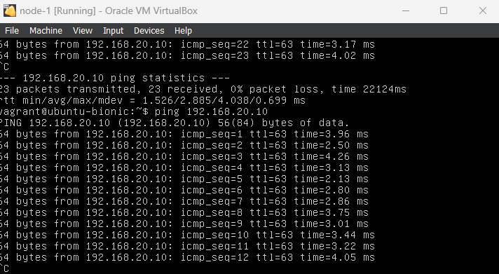
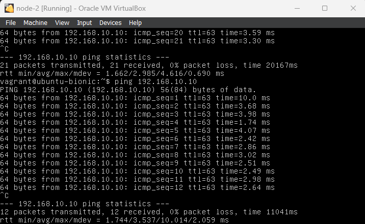

# Implementasi Terraform Dengan VirtualBox

Panduan ini menjelaskan langkah-langkah untuk melakukan *spawning* VM menggunakan Terraform pada VirtualBox dan konfigurasi routing serta subnetting dalam VM.

## Prerequisites

Pastikan perangkat berikut sudah terpasang pada komputer Anda:
- [VirtualBox](https://www.virtualbox.org/)
- [Terraform](https://www.terraform.io/)

## Langkah-Langkah

### 1. Konfigurasi Network

Buatlah VirtualBox Host-Only Ethernet Adapter dengan langkah berikut:
1. Buka **Network** di sidebar atas VirtualBox.
   


3. Klik **Create**. Jika muncul peringatan, klik **Yes**.
4. Pilih adapter yang baru dibuat, **VirtualBox Host-Only Ethernet Adapter**.


5. Atur IPv4 address dan netmask sesuai kebutuhan. Contoh: `192.168.10.0/24` dan `192.168.20.0/24`.


### 2. Topologi

Topologi yang akan kita buat melibatkan satu router yang terhubung ke dua node, masing-masing dengan subnet `192.168.10.0/24` dan `192.168.20.0/24`.


### 3. Konfigurasi Terraform

Pada implementasi ini, kita akan menggunakan tiga file Terraform: `main.tf`, `variables.tf`, dan `outputs.tf`.

#### main.tf

File ini mendefinisikan infrastruktur untuk router dan dua node:

```hcl
terraform {
  required_providers {
    virtualbox = {
      source  = "terra-farm/virtualbox"
      version = "0.2.2-alpha.1"
    }
  }
}

resource "virtualbox_vm" "router" {
  name      = var.router_name
  image     = var.image
  cpus      = var.cpus
  memory    = var.memory
  user_data = file(var.user_data_file)

  network_adapter {
    type = "nat"
  }

  network_adapter {
    type           = "hostonly"
    host_interface = var.host_only_adapter1
  }

  network_adapter {
    type           = "hostonly"
    host_interface = var.host_only_adapter2
  }
}

resource "virtualbox_vm" "node1" {
  name      = var.node1_name
  image     = var.image
  cpus      = var.cpus
  memory    = var.memory
  user_data = file(var.user_data_file)

  network_adapter {
    type           = "hostonly"
    host_interface = var.host_only_adapter1
  }
}

resource "virtualbox_vm" "node2" {
  name      = var.node2_name
  image     = var.image
  cpus      = var.cpus
  memory    = var.memory
  user_data = file(var.user_data_file)

  network_adapter {
    type           = "hostonly"
    host_interface = var.host_only_adapter2
  }
}
```
#### Penjelasan

**Provider**
<br>
Menggunakan `terra-farm/virtualbox` sebagai provider untuk membuat VM di VirtualBox. Provider ini memungkinkan Terraform untuk mengelola sumber daya VirtualBox, termasuk pembuatan dan pengaturan virtual machines.

**Resources**
- **Router**
  - VM yang bertindak sebagai router dengan:
    - Dua hostonly adapter untuk jaringan internal
    - Satu adapter NAT untuk koneksi internet

- **Node1 dan Node2**
  - Dua node dengan satu adapter hostonly yang terhubung pada subnet masing-masing, yang memungkinkan komunikasi antara node dan router.

#### variables.tf

File ini mendefinisikan variabel-variabel yang diperlukan.

```hcl
variable "router_name" {
  description = "Name of the router VM"
  type        = string
  default     = "router"
}

variable "node1_name" {
  description = "Name of the first node VM"
  type        = string
  default     = "node-1"
}

variable "node2_name" {
  description = "Name of the second node VM"
  type        = string
  default     = "node-2"
}

variable "image" {
  description = "Image for the VMs"
  type        = string
  default     = "https://app.vagrantup.com/ubuntu/boxes/bionic64/versions/20180903.0.0/providers/virtualbox.box"
}

variable "cpus" {
  description = "Number of CPUs for the VMs"
  type        = number
  default     = 1
}

variable "memory" {
  description = "Memory allocated for the VMs in MiB"
  type        = string
  default     = "512 mib"
}

variable "user_data_file" {
  description = "Path to the user data file"
  type        = string
  default     = "${path.module}/user_data"
}

variable "host_only_adapter1" {
  description = "Host-only Ethernet Adapter for Node 1"
  type        = string
  default     = "VirtualBox Host-Only Ethernet Adapter #4"
}

variable "host_only_adapter2" {
  description = "Host-only Ethernet Adapter for Node 2"
  type        = string
  default     = "VirtualBox Host-Only Ethernet Adapter #5"
}
```
### Catatan Tambahan
- Buat file kosong bernama `user_data` di direktori proyek, yang akan digunakan dalam inisialisasi VM.
- Periksa pengaturan adapter jaringan di VirtualBox untuk memastikan mereka sesuai dengan konfigurasi yang diberikan di `variables.tf`.

### 4. Menjalankan Perintah Terraform

Untuk menjalankan konfigurasi Terraform, ikuti langkah-langkah berikut:

#### a. Navigasi ke Direktori Proyek
Pastikan bahwa Anda berada di direktori proyek yang menyimpan `main.tf`.

#### b. Inisiasi Terraform
```bash
terraform init
```

#### c. Membuat Rencana (Plan)
```bash
terraform plan
```

#### d. Menerapkan Konfigurasi (Apply)
```bash
terraform apply
```

Atau untuk menghindari konfirmasi, gunakan:
```bash
terraform apply -auto-approve
```

### 5. Memeriksa Output

Setelah `terraform apply` dijalankan, VM akan muncul di VirtualBox. Masuk ke dalam VM tersebut untuk melanjutkan konfigurasi.

### 6. Konfigurasi IP

#### Router
Setelah melakukan _spawning_ VM, buka VM tersebut dan lakukan:

```bash
sudo nano /etc/netplan/50-cloud-init.yaml
```
Perintah ini membuka file yang digunakan untuk mengatur jaringan di router.

Pada router, kita akan menghubungkan dengan 2 subnet, yaitu 192.168.10.0/24 dan 192.168.20.0/24, sehingga kita akan memasukkan konfigurasi di bawah ini ke dalam `50-cloud-init.yaml`:

```bash
network:
  version: 2
  ethernets:
    enp0s8:
      dhcp4: no
      addresses:
        - 192.168.10.1/24
    enp0s9:
      dhcp4: no
      addresses:
        - 192.168.20.1/24
```
Dari code di atas, kita memberi alamat IP statis untuk dua antarmuka jaringan router. enp0s8 akan digunakan untuk Node 1 dan enp0s9 untuk Node 2.

Setelah memasukkan konfigurasi, jalankan perintah berikut untuk menerapkan perubahan:
```bash
sudo netplan apply
```

Kemudian, lakukan up pada ethernet:
```bash
sudo ip link set enp0s8 up
sudo ip link set enp0s9 up
```
Perintah di atas ini mengaktifkan interface jaringan agar router bisa berkomunikasi.

Langkah selanjutnya, untuk memastikan router dapat meneruskan paket data antara node, kita harus mengaktifkan IP forwarding:
```bash
sudo sysctl -w net.ipv4.ip_forward=1
```

Selanjutnya, kita perlu mengatur iptables agar router dapat menangani lalu lintas:
```bash
sudo iptables -t nat -A POSTROUTING -o enp0s17 -j MASQUERADE
```
Perintah di atas akan menyembunyikan alamat IP asli dari paket yang keluar dari router, membantu dalam pengaturan jaringan.

Tambahkan rute untuk masing-masing node sehingga router tahu cara mencapai mereka:
```bash
sudo ip route add 192.168.10.0/24 via 192.168.10.1
sudo ip route add 192.168.20.0/24 via 192.168.20.1
```
Perintah ini memberi tahu router bagaimana menemukan Node 1 dan Node 2.

Untuk sementara, kita matikan firewall (UFW) agar tidak menghalangi koneksi:
```bash
sudo ufw disable
```
Menonaktifkan firewall memungkinkan semua lalu lintas jaringan melewati tanpa batasan.

#### Node 1

Masukkan konfigurasi berikut pada `50-cloud-init.yaml`
```bash
network:
  version: 2
  ethernets:
    enp0s17:
      dhcp4: no
      addresses:
        - 192.168.10.10/24
      gateway4: 192.168.10.1
```
Di sini, kita memberi Node 1 alamat IP dan menyebutkan router sebagai gateway.

Lalu, Jalankan perintah ini untuk menerapkan pengaturan:
```bash
sudo netplan apply
```

Setelah itu, kita aktifkan interface jaringan node 1:
```bash
sudo ip link set enp0s17 up
```

#### Node 2

Buka terminal di Node 2 dan jalankan perintah berikut:
```bash
sudo nano /etc/netplan/50-cloud-init.yaml
```

Di dalam file, masukkan konfigurasi berikut:
```bash
network:
  version: 2
  ethernets:
    enp0s17:
      dhcp4: no
      addresses:
        - 192.168.20.10/24
      gateway4: 192.168.20.1
```

Jalankan perintah ini untuk menerapkan pengaturan:
```bash
sudo netplan apply
```

Setelah itu, kita aktifkan interface jaringan node 2:
```bash
sudo ip link set enp0s17 up
```

### 7. Lakukan testing pada routing

Setelah itu kita cek dengan node1 melakukan ping pada node2 dan sebaliknya, serta router melakukan ping pada masing-masing node.

Pada node1:
```bash
ping 192.168.20.10
```
Hasil:




Pada node2:
```bash
ping 192.168.10.10
```
Hasil:

