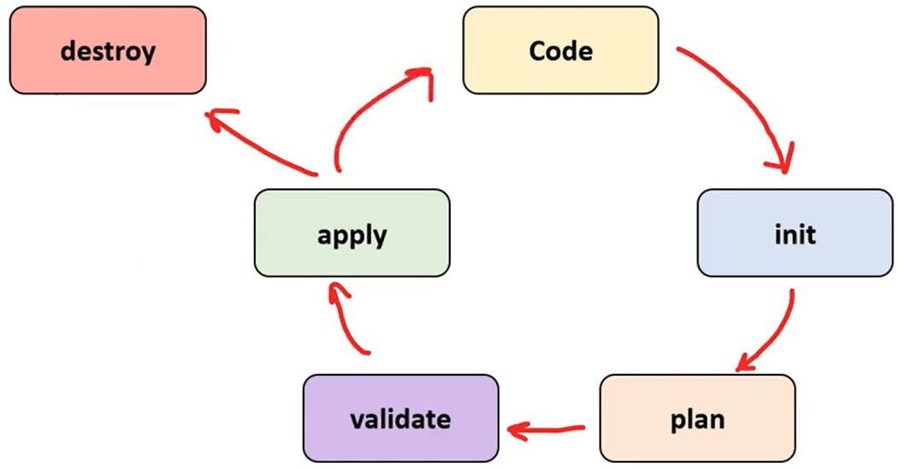
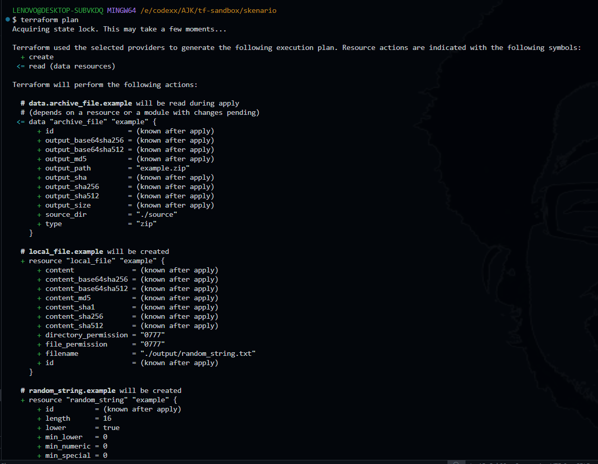
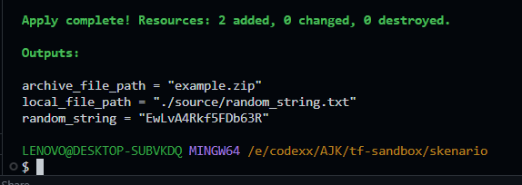

# Terraform

## A. Pengenalan

### 1. Infrastructure as Code (IaC)


Bayangkan kamu harus membangun sebuah rumah dengan spesifikasi khusus. Untuk satu rumah, mungkin cukup mudah memberi tahu tukang tentang detailnya, dan mereka bisa membangunnya sesuai keinginanmu. Tapi, bayangkan jika kamu melamar seorang wanita, dan dia meminta dibuatkan 1000 rumah dalam semalam. Tentu sangat sulit jika kamu harus menjelaskan spesifikasi rumah yang sama ke setiap tukang satu per satu!

Karena kamu orang yang cerdas, akhirnya kamu membuat rencana dan instruksi pembangunan rumah tersebut dalam satu dokumen yang detail. Dengan begitu, cukup memberikan instruksi ini kepada setiap tukang, dan mereka bisa membangun rumah dengan spesifikasi yang sama persis, tanpa harus bertanya lagi.

Nah, begitulah cara kerja *Infrastructure as Code* (IaC). Di sini, kamu menuliskan rencana dan instruksi pembuatan infrastruktur dalam bentuk kode. Kode ini bisa dijalankan kapan saja untuk membangun infrastruktur sesuai spesifikasi yang sudah ditulis.

#### Manfaat dari IaC
- <b> Efisien dan otomatis</b>

    Kamu tinggal pakai petunjuk yang sudah ada tanpa harus jelaskan ulang dari awal. Mau bangun 1 rumah atau 100 rumah, petunjuknya tinggal dipakai saja!

- <b> Konsistensi </b>

    Semua rumah yang dibangun dari petunjuk ini akan seragam. Tidak ada yang lebih tinggi, atau kurang jendela, karena semuanya mengikuti instruksi yang sama.

- <b> Mudah dikelola </b>

    Kalau mau ubah sedikit desain rumah, kamu tinggal edit petunjuknya saja. Hal ini juga dapat diimplementasikan pada code dalam memmbentuk infrastruktur.

#### Contoh Implementasi IaC Dalam Kasus Nyata


Saat hari belanja besar seperti 11.11, biasanya pengunjung situs e-commerce meningkat pesat. Dengan IaC, tim infrastruktur bisa menyiapkan autoscaling untuk menambah server atau kapasitas saat pengunjung melonjak. Setelah selesai, mereka cukup menonaktifkan server tambahan melalui kode, menghemat biaya karena kapasitas tambahan hanya aktif saat diperlukan.

#### Contoh Tools IaC
- <b> Terraform </b>

    Terraform merupakan alat yang digunakan untuk membuat dan mengelola infrastruktur IT secara otomatis dengan menggunakan kode.

    <b> Contoh penggunaan: </b>
    
    Jika kamu ingin menyiapkan 10 server dan database di cloud, kamu cukup menuliskan konfigurasi di Terraform, dan dengan satu perintah, akan dibuat secara otomatis sesuai dengan spesifikasi yang ditentukan.

<br>

- <b> Ansible </b>
    
    Ansible merupakan alat otomatisasi yang fokus pada pengaturan dan manajemen konfigurasi sistem.


    <b> Contoh penggunaan: </b>

    Jika kamu memiliki beberapa server dan ingin menginstal perangkat lunak atau mengatur konfigurasi tertentu, Ansible bisa melakukan semuanya sekaligus, tanpa perlu melakukan instalasi satu per satu.

<br>

### 2. Terraform

#### Pengertian
Terraform merupakan alat untuk melakukan otomatisasi dalam pembuatan, pengaturan, dan penghapusan infrastruktur IT. Terraform membantu dalam penulisan konfigurasi (atau dalam analogi sebelumnya adalah "rencana pembangunan") yang dapat digunakan kembali dan diatur dengan mudah.


#### Penggunaan dan Manfaat
a. Penggunaan
- Membuat server, jaringan, dan layanan cloud hanya dengan satu konfigurasi dan perintah
- Menerapkan infrastruktur yang sama di beberapa _environment_ (seperti produksi, pengujian, atau pengembangan).
- Menyesuaikan atau mengubah infrastruktur dengan cepat hanya dengan memperbarui konfigurasi.

b. Manfaat
- <b> Efisiensi</b>, hal ini didapat dalam mudahnya melakukan otomasisasi dan pengelolaan infrastruktur menggunakan konfigurasi Terraform.
- <b> Konsistensi</b>, dikarenakan diatur dengan menggunakan satu konfigurasi, maka banyak node akan konsisten dengan pengaturan satu konfigurasi.
- <b> Skalabilitas</b>, dengan menggunakan satu konfigurasi Terraform, kalian dapat membuat/mengelola banyak infrastruktur dengan mudah.

#### Terraform bisa digunain di case kaya gimana?

Bayangkan kamu sedang praktikum, dan soal praktikumnya meminta kamu untuk membuat 10,000 VM dengan ukuran disk spesifik, di mana 5,000 VM menggunakan image Debian, dan sisanya menggunakan image Kali Linux. Karena kamu orang yang cerdas, kamu hanya membuat satu konfigurasi Terraform. Di dalam konfigurasi itu, kamu menentukan untuk membuat 5,000 VM dengan image Debian dan 5,000 VM lainnya dengan image Kali Linux, serta menetapkan ukuran disk sesuai ketentuan soal.

Setelah selesai membuat konfigurasi, kamu tinggal menjalankan perintah Terraform, dan semua VM akan dibuat secara otomatis. Dengan cara ini, kamu tidak perlu repot membuat VM satu per satu.

## B. Instalasi
### 1. Linux
#### a. Update dan Install Dependensi
```
sudo apt-get update && sudo apt-get install -y wget unzip
```
#### b. Download Terraform
```
wget -O- https://apt.releases.hashicorp.com/gpg | sudo gpg --dearmor -o /usr/share/keyrings/hashicorp-archive-keyring.gpg
echo "deb [signed-by=/usr/share/keyrings/hashicorp-archive-keyring.gpg] https://apt.releases.hashicorp.com $(lsb_release -cs) main" | sudo tee /etc/apt/sources.list.d/hashicorp.list
sudo apt update && sudo apt install terraform
```
#### c. Verifikasi Instalasi
```
terraform -v
```

### 2. Windows
#### a. Download Terraform
Buka situs berikut https://developer.hashicorp.com/terraform/install dan pilih binary download yang disesuaikan dengan spesifikasi laptop kalian, pilih 386 untuk 32-bit dan amd64 untuk 64-bit/x86.

#### b. Ekstrak File
Ekstrak file yang awalnya di-zip, lalu di situ terdapat `terraform.exe`.

#### c. Tambahkan Terraform ke Path
Pindahkan file `terraform.exe` ke folder yang sudah ada di Path, atau tambahkan folder tempat `terraform.exe` berada ke Environment Variables Path.

<b> Langkah menambahkan ke path: </b>
- Buka <b>System Properties > Advanced > Environment Variables</b>.
- Pilih <b>Path</b> pada <b>System Variables</b>, klik <b>Edit</b>, dan tambahkan lokasi folder `terraform.exe`.

#### D. Verifikasi Instalasi
Lakukan verifikasi instalasi pada command prompt (CMD) atau Powershell dengan command berikut:
```
terraform -v
```

<br>

## C. Lifecycle Terraform



Lifecycle Terraform merujuk pada serangkaian langkah atau tahapan yang dilakukan dalam penggunaan Terraform untuk mengelola infrastruktur. Tahapan ini meliputi:

* **Menulis atau memperbarui konfigurasi Terraform:** 

  Menyiapkan file konfigurasi yang mendefinisikan infrastruktur.

* **Inisialisasi project dengan menjalankan command `terraform init`:** 

  Menginisialisasi proyek dan menarik providers atau modules yang dibutuhkan. Untuk mengubah atau mengupdate versi providers atau modules yang digunakan dapat menggunakan opsi `-upgrade`

* **Perencanaan dengan menjalankan command `terraform plan`:** 

  Melihat perubahan yang akan diterapkan dan membuat execution plan.

* **Validasi dengan menjalankan command `terraform validate`:** 
  
  Memastikan bahwa konfigurasi sesuai dengan tipe dan nilai yang valid.

* **Menjalankan menjalankan command `terraform apply`:**

  Menerapkan perubahan yang ada dalam execution plan, atau menggunakan command `terraform destroy` untuk menghapus infrastruktur yang ada. Untuk menambahkan atau menghapus konfigurasi spesifik dapat menggunakan opsi `-target=[tipe_resource].[nama_resource]`

* **Pembaharuan konfigurasi:**

  Siklus ini kembali berlanjut ke tahap pembaruan konfigurasi sesuai kebutuhan.

<br>

## D. Terraform Core Concepts

### a. Variables

Variabel dalam Terraform adalah cara untuk membuat konfigurasi yang lebih dinamis dan fleksibel. Dengan menggunakan variabel, hardcoding dapat dihindari nilai-nilai tertentu dalam file konfigurasi. Berikut adalah penjelasan singkat tentang beberapa aspek penting dari variabel dalam Terraform:

1. **Variable Type**:

   Terraform mendukung beberapa jenis tipe data untuk variabel, termasuk:
      - **string**: Menyimpan nilai teks (misalnya, nama, alamat).
      - **number**: Menyimpan nilai numerik (misalnya, 10, 100.5).
      - **bool**: Menyimpan nilai boolean (misalnya, true atau false).
      - **list(type)**: Daftar dari beberapa elemen yang memiliki tipe yang sama (misalnya, list(string)).
      - **set(type)**: array yang berisi elemen unik (misalnya, set(number)).
      - **map(type)**: Menyimpan pasangan key-value (misalnya, map(string)).
      - **object**: Tipe variabel yang lebih kompleks yang dapat mencakup beberapa atribut dengan tipe yang berbeda.
      - **tuple**: Menggunakan urutan elemen dengan tipe yang berbeda.
   
   <br>

   Tipe variabel dapat dispesifikasikan dengan menggunakan atribut `type` dalam deklarasi variabel. Misalnya:
     ```hcl
     variable "instance_count" {
       type = number
     }
     ```

<br>

2. **default**:
      Default adalah salah satu atribut dalam deklarasi variable yang berfungsi untuk menginisiasi nilai dari variable tersebut.
      
      ```hcl
      variable "instance_count" {
       type = number
       default = 10
      }
      ```

      Jika atribut default tidak di tuliskan, ada beberapa cara yang dapat dilakkan untuk mengisi value dari variable tersebut.
      - Mengisi prompt pada saat `terraform apply` <br>

      

      - Menggunakan opsi `-var` pada comman `terraform apply` <br>
      ```bash
      terraform apply -var="var_name=var_value"
      ```

      - Menggunakan file `.tfvars` atau `.auto.tfvars`
      - Mengunaakn Environment Variable

<br>

3. **.tfvars / auto.tfvars**:

      Untuk variable sensitif seperti password atau api token, kita tidak bisa meng-hardcode nilai variable tersebut kedalam file konfigurasi main.tf, dan akan sangat tidak praktikal jika perlu mengisi secara manual variable tersebut setiap kali mmelakukan `terraform apply`. Maka dari itu, kita dapat membuat file khusus untuk menyimpan semua variable yang akan digunakan pada main.tf dengan menggunakan tipe file `.tfvars`. File ini menggunakan format key value pair.
      
      Contoh:
      ```hcl
      token = "tokenabalabal"
      password = "supersecretpassword"
      ``` 
      <br>
      Sebelum bisa menggunakan variable yang sudah kita simpan dalam `.tfvars` kita perlu melakukan beberapa hal terlebih dahulu:

      - Deklarasi variable pada main.tf <br>
        Karena `.tfvars` merupakan cara untuk memberi input pada variable, bukan deklarasi variable, kita perlu mendeklarasikan terlebih dahulu variable dengan nama yang sama pada main.tf <br>

          ```hcl
          variable "password" {}
          variable "token" {}
          ``` <br>

      - Menspesifikasikan file `.tfvars` yang digunakan pada saat apply menggunakan opsi `--var-file=<nama_file>.tfvars` <br>
          ```bash
          terraform apply --var-file="secret.tfvars"
          ``` 
      <br>

      Selain `.tfvars` ada juga tipe file `.auto.tfvars`, perbedaannya adalah kita tidak perlu menggunakan opsi `--var-file` karena terraform otomatis akan menggunakan file tersebut.

      <br>

      Lalu kenapa kita tidak menggunakan `.auto.tfvars` saja? Kapan kita perlu menggunakan `.tfvars`?

      <br>
      
      `.tfvars` sangat berguna ketika kita punya beberapa environment berbeda seperti **development**, **staging**, dan **porduction** yang memiliki credential yang berbeda-beda, sehingga kita bisa memilih untuk menggunakan `.tfvars` yang mana yang mau digunakan. 
      
      <br>

4. **Environment Variables (env)**:
   - Variabel lingkungan juga dapat digunakan untuk menetapkan nilai variabel dalam Terraform.
   - Variabel lingkungan harus diawali dengan `TF_VAR_`, diikuti dengan nama variabel. Misalnya:
     ```bash
     export TF_VAR_instance_count=3
     ```

<br>

5. **Sensitive Variables**:
   - Dengan menandai variabel sebagai `sensitive`, Terraform akan menyembunyikan nilai variabel tersebut dari output log untuk menjaga kerahasiaan data sensitif.
   - Contoh deklarasi variabel sensitif:
     ```hcl
     variable "db_password" {
       type      = string
       sensitive = true
     }
     ```

<br>

6. **Validation**:
   - Terraform mendukung validasi variabel dengan menggunakan blok `validation` untuk memastikan bahwa nilai yang diberikan memenuhi kriteria tertentu.
   - Contoh validasi:
     ```hcl
     variable "instance_count" {
       type = number
       validation {
         condition     = var.instance_count > 0
         error_message = "Instance count must be greater than zero."
       }
     }
     ```

Dengan menggunakan variabel, Anda dapat membuat konfigurasi Terraform yang lebih fleksibel dan mudah diatur ulang sesuai kebutuhan.

### b. State
State adalah file yang menyimpan informasi tentang infrastruktur yang telah dibuat oleh Terraform. File ini penting untuk melacak perubahan yang telah diterapkan.

Berikut adalah penjelasan singkat namun detail tentang modul, sumber daya (resource), sumber data (data source), dan hubungan mereka dengan provider dalam Terraform:

### c. Module
   - Modul adalah unit dasar dari organisasi dalam Terraform. Setiap konfigurasi Terraform adalah modul, dan modul dapat digunakan untuk mengelompokkan sumber daya terkait untuk digunakan kembali.
   - Modul dapat bersifat lokal atau diambil dari repositori jarak jauh seperti Terraform Registry.
   - Modul digunakan dengan mendeklarasikan blok `module` dan menentukan sumber serta variabel yang diperlukan.
   - Contoh penggunaan modul:
     ```hcl
     module "network" {
       source = "./modules/network"
       vpc_id = var.vpc_id
     }
     ```

### d. Resource
   - Resource adalah blok dasar dalam Terraform yang mendefinisikan objek infrastruktur seperti instans EC2, bucket S3, atau database RDS.
   - Setiap resource memiliki tipe dan nama, serta atribut yang dapat dikonfigurasi.
    
      ```hcl
      resource "tipe_resource" "nama_resource" {
        atribut = value
      }
      ```

   - Contoh:
     ```hcl
     resource "aws_instance" "example" {
       ami           = "ami-0c55b159cbfafe1f0"
       instance_type = "t2.micro"
     }
     ```

### e. Data Source
   - Data Source digunakan untuk mengambil informasi dari infrastruktur atau layanan yang ada tanpa mengubahnya.
   - Data source berguna untuk mendapatkan informasi yang diperlukan untuk mengonfigurasi resource lainnya.
   - Contoh:
     ```hcl
     data "aws_ami" "latest" {
       most_recent = true
       owners      = ["self"]
     }
     ```

### f. Provider
   - Provider adalah plugin yang mengelola interaksi dengan layanan API untuk sumber daya yang Anda definisikan.
   - Setiap provider harus dikonfigurasi sebelum digunakan, dan biasanya menentukan kredensial dan wilayah.
   - Contoh konfigurasi provider:
     ```hcl
     provider "aws" {
       region = "us-west-2"
     }
     ```

### g. Terraform Registry
Terraform Registry adalah repositori publik yang menyediakan modul-modul siap pakai untuk infrastruktur sebagai kode (IaC) dengan Terraform. Registry ini memudahkan pengguna menemukan, berbagi, dan menggunakan modul yang mengelola sumber daya di berbagai cloud provider serta infrastruktur lain. Pengguna juga bisa membuat registry privat untuk modul khusus organisasi, menjaga keamanan dan konsistensi infrastruktur.

Secara sederhana, Terraform regitry mirip dengan DockerHub atau GitHub

<br>

## E. Terraform Config

Secara umum, project terraform terbagi menjadi 3 file, yaitu `main.tf`, `variables.tf`, serta `outputs.tf`

### 1. main.tf
`main.tf` adalah file utama dalam konfigurasi Terraform di mana Anda mendefinisikan sumber daya infrastruktur yang ingin Anda buat, ubah, atau hapus. File ini biasanya berisi blok konfigurasi yang mendeskripsikan penyedia (provider) dan sumber daya (resources) yang akan dikelola oleh Terraform.

Dalam contoh di atas, kita mendefinisikan penyedia AWS dan sebuah sumber daya berupa instance EC2 dengan tipe `t2.micro`.

### 2. variables.tf
`variables.tf` adalah file tempat Anda mendefinisikan variabel yang memungkinkan Anda untuk membuat konfigurasi yang lebih dinamis dan dapat disesuaikan. Anda dapat mendefinisikan variabel dengan tipe data tertentu dan memberikan nilai default jika diperlukan.

Dengan mendefinisikan variabel di `variables.tf`, Anda dapat menggunakannya dalam file `main.tf` untuk menggantikan nilai yang sebelumnya ditentukan secara statis.


### 3. outputs.tf
`outputs.tf` adalah file yang digunakan untuk mendefinisikan output dari konfigurasi Terraform. Output ini dapat memberikan informasi penting tentang sumber daya yang dibuat, seperti alamat IP atau ID sumber daya.

Output ini akan ditampilkan setelah Anda menjalankan `terraform apply`, sehingga Anda dapat dengan mudah melihat informasi penting dari sumber daya yang telah Anda buat.

### Kesimpulan
Dengan memahami dan menggunakan ketiga file ini (`main.tf`, `variables.tf`, dan `outputs.tf`), Anda dapat membuat konfigurasi Terraform yang lebih terstruktur, dinamis, dan mudah dikelola. Anda dapat menyesuaikan konfigurasi dengan variabel dan mendapatkan informasi penting melalui output yang didefinisikan.

### Skenario
Berikut adalah contoh skenario penggunaan file `main.tf`, `variables.tf`, dan `outputs.tf`.

#### 0. Setup project directory

Buat file `main.tf`, `variables.tf`, dan `outputs.tf`, serta buat directory bernama `source`


#### 1. main.tf
Di dalam `main.tf`, kita akan menggunakan beberapa provider lokal untuk mendemonstrasikan bagaimana utilities ini dapat digunakan.

Tambahkan konfigurasi "random" berikut untuk membuat string random
```hcl
provider "random" {}

resource "random_string" "example" {
  length  = 16
  special = false
}

```

Tambahkan konfigurasi "archive" untuk melakukan zip pada file
```hcl
provider "archive" {}

data "archive_file" "example" {
  type        = "zip"
  source_dir  = var.source_dir
  output_path = "example.zip"
  depends_on = [
    local_file.example
  ]
}
```

> depends_on digunakan agar `archive_file` akan dijalankan **SETELAH** `local_file` membuat file di dalam direktori source, karena jika kita mau melakukan zip di suatu direktori kosong maka akan error


Tambahkan konfigurasi "local" untuk memodifikasi file pada directory komputer kalian masing-masing

```hcl
provider "local" {}

resource "local_file" "example" {
  content  = random_string.example.result
  filename = "${var.source_dir}/random_string.txt"
}
```

#### 2. variables.tf
Kita akan mendefinisikan beberapa variabel yang digunakan dalam `main.tf` untuk menentukan direktori sumber dan tujuan.

Tambahkan variabel source_dir
```hcl
variable "source_dir" {
  description = "Direktori sumber yang akan diarsipkan"
  type        = string
  default     = "./source"
}
```

Variabel ini membantu kita untuk menentukan direktori sumber yang akan diarsipkan dan direktori tujuan untuk menyimpan file hasil.

#### 3. outputs.tf
Di dalam `outputs.tf`, kita akan mendefinisikan beberapa output untuk menampilkan hasil dari operasi yang telah dilakukan.

```hcl
output "random_string" {
  description = "String acak yang dihasilkan"
  value       = random_string.example.result
}

output "archive_file_path" {
  description = "Path dari file arsip yang dihasilkan"
  value       = data.archive_file.example.output_path
}

output "local_file_path" {
  description = "Path dari file lokal yang dibuat"
  value       = local_file.example.filename
}
```

Output ini akan memberikan informasi tentang string acak yang dihasilkan, lokasi file arsip, dan lokasi file lokal yang dibuat.

#### Run Konfigurasi

Setalah semua file sudah dibuat lakuka:

```bash
terraform init
```

maka akan menghasilkan tampilan seperti berikut:


Kemudian jalankan command plan untuk mengecek apakah behaviour dari konfigurasi yang sudah kita buat sudah sesuai keinginan kita:

```bash
terraform plan
```



Lalu lakukan apply untuk menjalankan konfigurasi

```bash
terraform apply
```

ketikkan "yes" ketika diminta

Setelah selesai, maka outputs yang sudah didefinisikan akan keluar:


